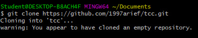
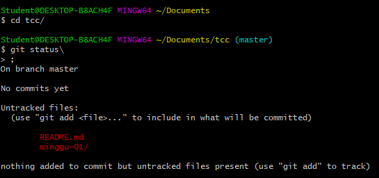
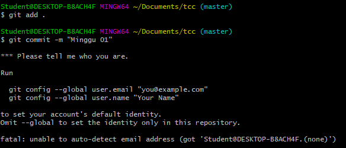
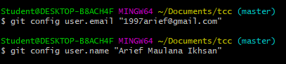
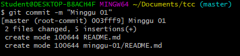
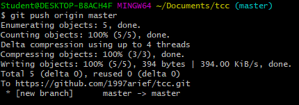
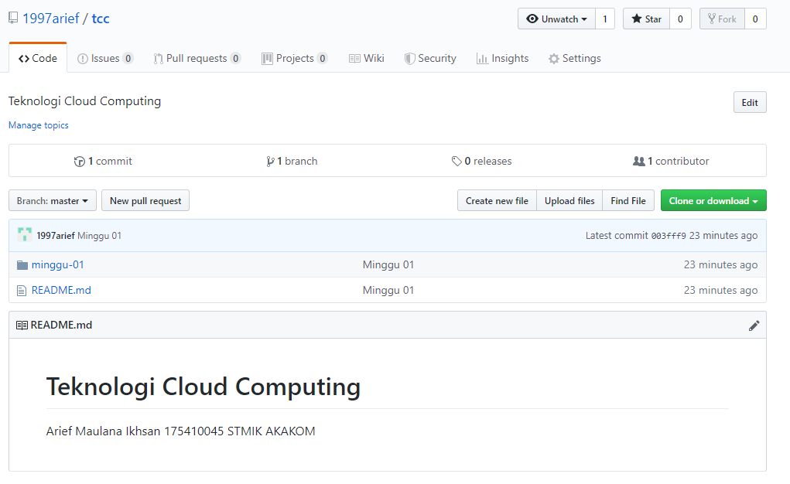

# Minggu 01
1. Clone Git  
  
2. Check diff from git  
  
3. Try add diff file then commit it  
   
 Oops, we must config email and name for this local repo  
 4. Config email and name for git
   
 5. Recommit the change  
   
 6. Push change to master branch  
    
 7. Woah, check your repo and its been updated :)  
 
