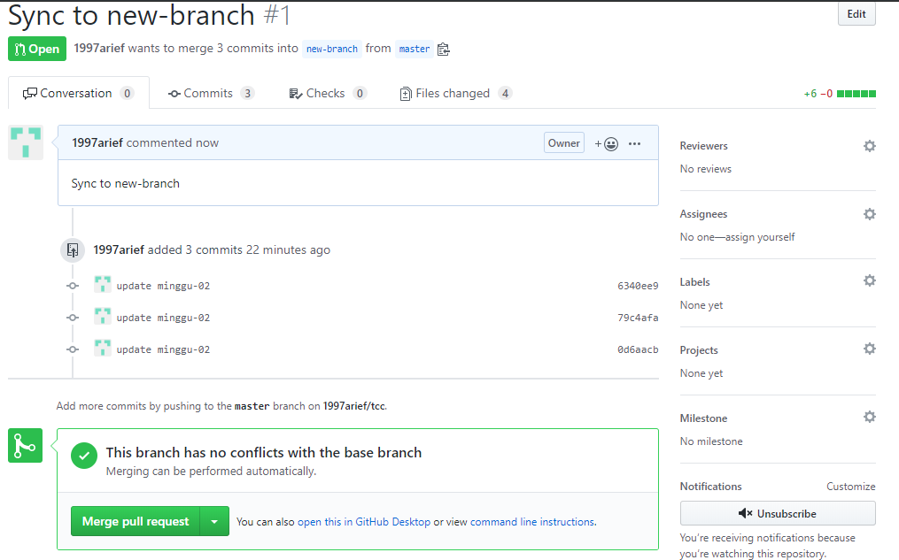

# Minggu 02  
1. Remove changed file using: ```git rm filename```  
  
2. Create new branch  
  
its new-branch  
  
3. Create pull request to sync from another branch  
  
  
  
  
4. Change branch  
  
5. Can't push because it must be pull before  
  
6. Pull change again  
 
7. Merge branch master from new-branch  
  