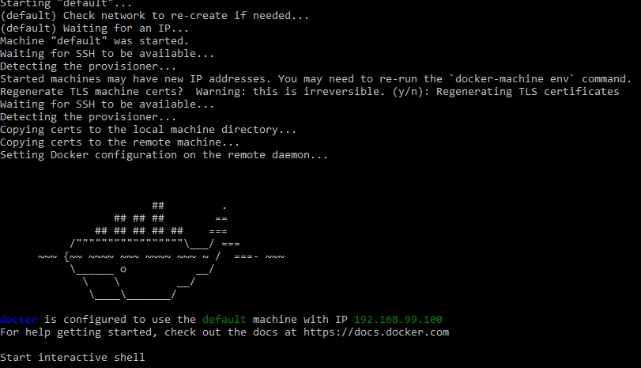

# Minggu 05  
## Cokroach DB  
1. You must install Docker first  

2. Then, install Cokroach DB using Docker  
```
$ docker pull cockroachdb/cockroach:v19.1.5
v19.1.5: Pulling from cockroachdb/cockroach
27833a3ba0a5: Pull complete 
7eeeadc1cbce: Pull complete 
58d28f3214d5: Pull complete 
7c994667c40c: Pull complete 
Digest: sha256:44249e8133bd5c02165703854a86d84089fa741a018071cfe41b5ce4cda7ac39
Status: Downloaded newer image for cockroachdb/cockroach:v19.1.5
```  
3. Bridge Network untuk Docker  
```
$ docker network create -d bridge roachnet
2b171086a79ab8f79be3ac272c1afaf40dd4e9340746081e71704fc050af257d
```  
4. Start the first node
```
$ docker run -d --name=roach2 --hostname=roach2 --net=roachnet -p 26257:26257 -p 8008:8008  -v "${PWD}/cockroach-data/roach2:/cockroach/cockroach-data"  cockroachdb/cockroach:v19.1.5 start --insecure
1e2286015d7a51739964ef7b5a8bb3d91ccf3e4e04eb30927b2bf8c22426a5a1
```  
5. Check running container
```
$ docker ps -a
CONTAINER ID        IMAGE                           COMMAND                  CREATED             STATUS              PORTS                                                        NAMES
1e2286015d7a        cockroachdb/cockroach:v19.1.5   "/cockroach/cockroac…"   2 minutes ago       Up 2 minutes        0.0.0.0:8008->8008/tcp, 0.0.0.0:26257->26257/tcp, 8080/tcp   roach2
```   
5. Login into container cockroachdb
```
$ docker exec -it roach2 ./cockroach sql --insecure
# Welcome to the cockroach SQL interface.
# All statements must be terminated by a semicolon.
# To exit: CTRL + D.
#
# Server version: CockroachDB CCL v19.1.5 (x86_64-unknown-linux-gnu, built 2019/09/23 14:12:16, go1.11.6) (same version as client)
# Cluster ID: 000fef59-93c9-4484-80a3-580c4976d044
#
# Enter \? for a brief introduction.
#
root@:26257/defaultdb> 
```  
6. Create database
```
root@:26257/defaultdb> create database arief;
CREATE DATABASE

Time: 138.977153ms

root@:26257/defaultdb> show databases;
  database_name  
+---------------+
  arief          
  defaultdb      
  postgres       
  system         
(4 rows)

Time: 4.054053ms

root@:26257/defaultdb> use arief;
SET

Time: 1.303839ms
```   
7. Create table and insert data
```
root@:26257/arief> CREATE TABLE arief.accounts (id INT PRIMARY KEY, name VARCHAR, balance DECIMAL);
CREATE TABLE

Time: 155.13706ms

root@:26257/arief> insert into arief.accounts VALUES (1, 'Arief Maulana', 10000.69);
INSERT 1

Time: 49.022109ms

root@:26257/arief> select * from accounts;
  id |     name      | balance   
+----+---------------+----------+
   1 | Arief Maulana | 10000.69  
(1 row)

Time: 1.47514ms
```   