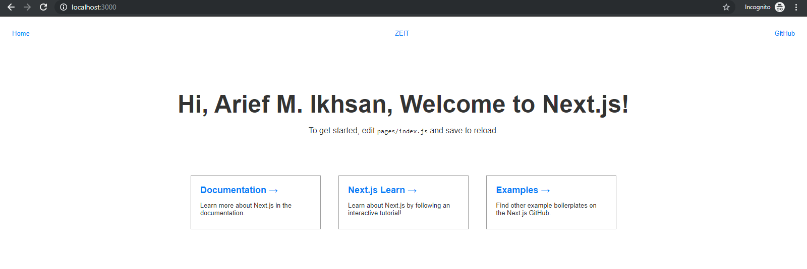

# Minggu 07  
## Zeit  
1. Open [Zeit](https://zeit.co) then Login using yout github, gitlab, or email  
2. The verification link will be send to your email, and click the link for verification login  
3. Install [Node.js](https://nodejs.org/en/download/) if you want to install npm for using zeit  
4.  Install 'Now' (other name of zeit)  
```
$ npm i -g now
```  
5. Login to Now  
```
$ npm login
```
  then verify your login using link that sent to your email  
6. Install next.js as your app
```
$ npm init next-app first-next
```  
7. Run dev on localhost
```
$ cd first-next
$ npm run dev
``` 
Open on your localhost and the default port for next.js is 3000
  
8. Build and start your project
```
$ npm run build
$ npm start
```  
and upload to your zeit project just using `now`  
```
$ now
```  
You can see my first next.js app at [https://first-next.arief.now.sh/](https://first-next.arief.now.sh/)