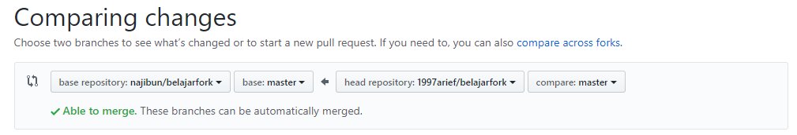
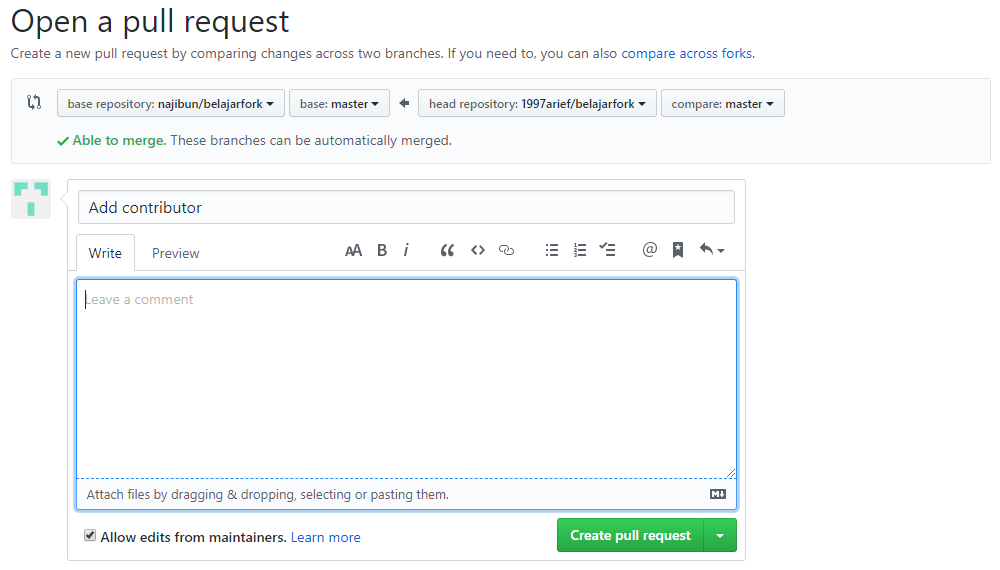

# Git for Collaboration  
## As Contributor  
1. Fork a repo  
2. Clone your repo  
3. Check remote address of repo  
```
$ git remote -v
origin  https://github.com/1997arief/belajarfork.git (fetch)
origin  https://github.com/1997arief/belajarfork.git (push)
```  
add remote 1997arief  
```
$ git remote add 1997arief https://github.com/najibun/belajarfork.git
$
$ git remote -v
1997arief       https://github.com/najibun/belajarfork.git (fetch)
1997arief       https://github.com/najibun/belajarfork.git (push)
origin  https://github.com/1997arief/belajarfork.git (fetch)
origin  https://github.com/1997arief/belajarfork.git (push)
```  
4. Fetch the change  
```
$ git fetch 1997arief
remote: Enumerating objects: 12, done.
remote: Counting objects: 100% (12/12), done.
remote: Compressing objects: 100% (9/9), done.
remote: Total 10 (delta 0), reused 7 (delta 0), pack-reused 0
Unpacking objects: 100% (10/10), done.
From https://github.com/najibun/belajarfork
 * [new branch]      master     -> 1997arief/master
```
5. Commit the change  
```
$ git add .
$ git commit -m "Add contributor"
[master 0dd2a74] Add contributor
 1 file changed, 2 insertions(+), 1 deletion(-)
$ git push origin master
Fatal: HttpRequestException encountered.
Username for 'https://github.com': 1997arief
Counting objects: 3, done.
Delta compression using up to 4 threads.
Compressing objects: 100% (2/2), done.
Writing objects: 100% (3/3), 342 bytes | 0 bytes/s, done.
Total 3 (delta 0), reused 0 (delta 0)
To https://github.com/1997arief/belajarfork.git
   d022b73..0dd2a74  master -> master
```
6. Compare change and Create Pull Request  
  
  

## As Owner
Lorem ipsum