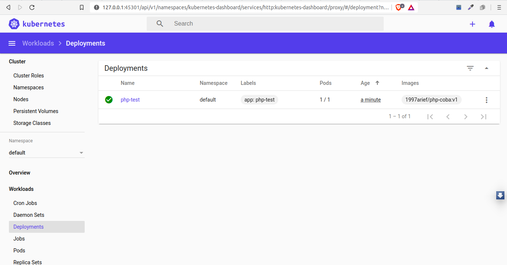
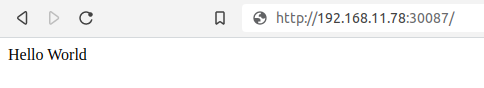

# Php on Kubernetes
## Create Dockerfile adn php file
`Dockerfile`
```dockerfile
FROM php:7.3-apache
COPY src/ /var/www/html/
```
`src/index.php`
```php
<?php
    phpinfo();
?>
```
then build and upload image to Docker Hub
```
$ sudo docker build -t 1997arief/php-coba:v1 .
```
login to your docker account
```
$ sudo docker login
Login with your Docker ID to push and pull images from Docker Hub. If you don't have a Docker ID, head over to https://hub.docker.com to create one.
Username: 1997arief
Password: 
WARNING! Your password will be stored unencrypted in /root/.docker/config.json.
Configure a credential helper to remove this warning. See
https://docs.docker.com/engine/reference/commandline/login/#credentials-store

Login Succeeded
```
push image to repo
```
$ sudo docker push 1997arief/php-coba:v1
```
## Run minikube
```
$ sudo minikube start --vm-driver=none
$ sudo minikube dashboard
```
create deployment 
```
$ kubectl create deployment php-test --image=1997arief/php-coba:v1
deployment.apps/php-test created
```
then checkit on browser  
  
you also can check it using terminal  
```
$ kubectl get deployments
NAME       READY   UP-TO-DATE   AVAILABLE   AGE
php-test   1/1     1            1           3m28s
$
$ kubectl get pods
NAME                        READY   STATUS    RESTARTS   AGE
php-test-777b77b6bc-q5h8s   1/1     Running   0          3m32s
$ kubectl get services
NAME         TYPE           CLUSTER-IP     EXTERNAL-IP   PORT(S)          AGE
kubernetes   ClusterIP      10.96.0.1      <none>        443/TCP          2m11s
php-test     LoadBalancer   10.96.246.27   <pending>     8008:30087/TCP   15s


```
expose it
```
$ kubectl expose deployment php-test --type=LoadBalancer --port=8008
service/php-test exposed

$ minikube service php-test
|-----------|----------|-------------|----------------------------|
| NAMESPACE |   NAME   | TARGET PORT |            URL             |
|-----------|----------|-------------|----------------------------|
| default   | php-test |             | http://192.168.11.78:30087 |
|-----------|----------|-------------|----------------------------|
🎉  Opening service default/php-test in default browser...
```  
  